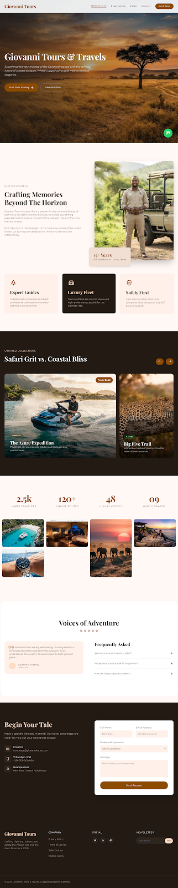

# Giovanni Tours & Travels

A one-page marketing site prototype for **Giovanni Tours & Travels**, a fictional luxury safari-and-coastal tour operator based in Kenya. Design concept: **"Rugged Elegance"** — savannah heat meets coastal cool.



## Stack

- Static HTML
- [Tailwind CSS](https://tailwindcss.com/) via the CDN build (`cdn.tailwindcss.com`), configured with a custom design-token theme (colors, type scale, spacing, radii)
- Google Fonts — Playfair Display (headings) & Montserrat (body)
- Material Symbols (icon font)
- No build step, no dependencies — open `index.html` and it runs

## Project structure

```
.
├── index.html              # single-page site markup
├── assets/
│   ├── css/
│   │   └── style.css       # small set of hand-written styles (glass effect, reveal animations, masonry grid)
│   └── js/
│       ├── tailwind-config.js  # Tailwind theme extension (colors, type, spacing, radii)
│       └── main.js             # scroll-reveal animation + navbar shrink-on-scroll
└── docs/
    ├── DESIGN.md            # design system reference (palette, type, layout, components)
    └── screenshot.png       # preview image
```

## Running locally

No build tools required. Either:

- Open `index.html` directly in a browser, or
- Serve it locally, e.g.:

  ```bash
  python3 -m http.server 8000
  ```

  then visit `http://localhost:8000`.

## Known limitations / TODO before shipping

This was exported from a design prototype (Google Stitch) and still has a few placeholders that need to be swapped out before it's production-ready:

- **Images are temporary Google-hosted URLs** (`lh3.googleusercontent.com/aida-public/...`). These are prototype/preview links and are not guaranteed to stay available — replace them with your own hosted images (e.g. in `assets/images/`) before deploying.
- **WhatsApp link** in the floating contact button points to a placeholder number (`wa.me/yournumber`) — update with a real number.
- **Contact form** (name/email/experience/message) is markup only — it doesn't submit anywhere yet. Wire it up to a backend, form service (e.g. Formspree, Netlify Forms), or serverless function.
- **FAQ accordion** buttons are static — clicking "+" doesn't currently expand an answer. Add a small script or `<details>/<summary>` markup if you want it functional.
- **Tailwind CDN build** is fine for a prototype but not recommended for production (larger payload, no purging). For production, consider installing Tailwind via npm and building a purged CSS file.

## Design reference

See [`docs/DESIGN.md`](docs/DESIGN.md) for the full design system: color palette, typography scale, spacing, elevation, and component conventions used throughout the page.

## License

No license specified yet — add one (e.g. MIT) if you plan to open source this.
